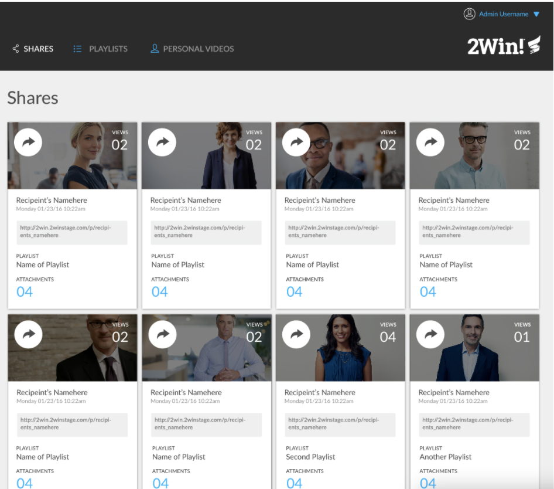

# The Dude Abides

By [Sarah Fitzsimons](https://github.com/sme93)

Deployed [site](https://sme93.github.io/static-comp-challenge/).

Original project spec can be found [here](https://frontend.turing.io/projects/module-1/m1-static-comp).

The static comp challenge allows the developer to recreate a webpage based off of a provided page for comparison. I was given the following page and asked to recreate it using HTML and CSS.

The instructions were to recreate the layout exactly, but were allowed to use different copy, images,
icons, and color palette. I decided to do a Big Lebowski theme since it's one of my favorite quotable movies.

The site must be responsive to different screen sizes and should work
across different browsers (Firefox, Safari, Chrome).

I used Eric Meyer's Reset CSS file in my project because we were instructed to reset or normalize our CSS.
I decided to go with a reset over the normalize file because I wanted the most consistency across all browsers.

Here is my final comp -

The site is responsive to four different screen sizes, I have three pictured here.

Desktop screen.

Mid-size screen.

Mobile.

